# Deep Biblio Tools

> **Note**: For AI/Claude collaboration patterns and project conventions, see [.claude/CLAUDE.md](.claude/CLAUDE.md)

Professional toolkit for academic paper processing, bibliographic validation, and automated literature review generation. This project provides enterprise-grade tools for processing academic papers, validating citations, and generating comprehensive literature reviews with proper academic formatting.

## 🚀 Key Features


- **📚 Citation Validation**: Automatically extract and validate citations against publisher databases
- **🔄 Format Conversion**: Convert between Markdown, LaTeX, and LyX formats
- **🎨 Academic Formatting**: Generate arXiv-ready LaTeX with proper citations and formatting
- **🔍 Smart Detection**: Find and fix citation inconsistencies automatically
- **💾 Intelligent Caching**: Avoid repeated API calls with built-in caching
- **🌐 Web Interface**: Interactive proofreading tool for manual corrections
- **📦 Batch Processing**: Handle individual files or entire directories
- **📝 Article Summarizer**: Create 25% comprehensive summaries preserving academic citations
- **📖 Literature Review Generator**: Automatically generate themed literature reviews from paper collections

## 📋 Table of Contents

- [Installation](#installation)
- [Quick Start](#quick-start)
- [Core Features](#core-features)
  - [Citation Validation](#citation-validation)
  - [Markdown to LaTeX Conversion](#markdown-to-latex-conversion)
  - [LyX Format Support](#lyx-format-support)
  - [Paper Processing with Caching](#paper-processing-with-caching)
  - [Web-based Proofreader](#web-based-proofreader)
  - [Article Summarizer](#article-summarizer)
- [Architecture](#architecture)
- [Development](#development)
- [Contributing](#contributing)
- [License](#license)

## 🛠️ Installation

### Prerequisites

- Python 3.12 or higher
- [uv](https://github.com/astral-sh/uv) (recommended for Python package management)
- Optional: [pandoc](https://pandoc.org/) for advanced conversions
- Optional: [LyX](https://www.lyx.org/) for LyX format support

### Using uv (Recommended)

```bash
# Clone the repository
git clone https://github.com/your-org/deep-biblio-tools.git
cd deep-biblio-tools

# Install dependencies
uv sync

# Install CLI tools
uv pip install -e .

# Activate virtual environment
source .venv/bin/activate  # On Windows: .venv\Scripts\activate
```

## 🎯 Quick Start

```bash
# Validate citations in a markdown file
uv run python -m deep_biblio_tools paper.md

# Convert markdown to arXiv-ready LaTeX
deep-biblio-md2latex paper.md --output-dir latex/

# Convert to LyX format
deep-biblio-to-lyx from-markdown paper.md
```

## 🔧 Core Features

### Citation Validation

The citation validator automatically finds and corrects bibliographic references in your documents:


**Usage:**

```bash
# Basic validation
uv run python -m deep_biblio_tools input.md

# Process entire directory
uv run python -m deep_biblio_tools docs/ --output-dir corrected/

# Dry run to preview changes
uv run python -m deep_biblio_tools input.md --dry-run

# Skip link validation for faster processing
uv run python -m deep_biblio_tools input.md --no-check-links
```

### Markdown to LaTeX Conversion

Convert academic Markdown documents to publication-ready LaTeX:


**Features:**
- Automatic citation extraction and BibTeX generation
- Technical concept boxes with customizable styles
- Two-column academic layout (default)
- arXiv-compliant formatting

**Usage:**

```bash
# Convert with default settings (two-column, arXiv-ready)
deep-biblio-md2latex paper.md

# Single-column layout
deep-biblio-md2latex paper.md --single-column

# Custom output directory and author
deep-biblio-md2latex paper.md -o ./output -a "Jane Doe"

# Choose concept box style
deep-biblio-md2latex paper.md --style modern_gradient
```

**Available Concept Box Styles:**
- `professional_blue` (default)
- `modern_gradient`
- `clean_minimal`
- `academic_formal`
- `technical_dark`

**Enhanced Bibliography Management:**

- **Zotero Integration** - Connect to your Zotero library for better metadata retrieval. See the [Zotero Setup Guide](docs/usage/zotero-setup-guide.md) for configuration instructions.
- **Multiple Data Sources** - Automatically fetches from CrossRef, arXiv, and Zotero
- **Smart Caching** - Reduces API calls with intelligent caching
- **Prefer arXiv** option - Use `--prefer-arxiv` to prioritize arXiv metadata

### LyX Format Support

Convert documents to LyX format for visual LaTeX editing:

```mermaid
graph LR
    subgraph Input Formats
        A[TeX/LaTeX]
        B[Markdown]
    end

    subgraph Conversion Process
        C[TeX → LyX]
        D[Markdown → LaTeX → LyX]
    end

    subgraph Output
        E[LyX Document]
    end

    A --> C --> E
    B --> D --> E
```



**Usage:**

```bash
# Convert LaTeX to LyX
deep-biblio-to-lyx from-tex document.tex

# Convert Markdown to LyX (simple mode)
deep-biblio-to-lyx from-markdown paper.md --simple

# Advanced conversion with citation processing
deep-biblio-to-lyx from-markdown paper.md

# Batch conversion
deep-biblio-to-lyx batch *.tex *.md --output-dir lyx_output/
```

### Paper Processing with Caching

Process entire directories of academic papers into comprehensive summaries and literature reviews:

```bash
# Process all papers in a directory
python process_papers_with_cache.py /path/to/papers/

# Force reprocess specific papers
python process_papers_with_cache.py /path/to/papers/ --force-reprocess "paper1.html"

# Show cache status
python process_papers_with_cache.py /path/to/papers/ --show-cache
```

**Features:**
- **25% Comprehensive Summaries**: Creates summaries exactly 25% of original size
- **Smart Caching**: Tracks processed files via MD5 hashing to avoid reprocessing
- **Citation Conversion**: Converts numeric [1] to author-year format (Smith et al., 2023)
- **Complete Bibliographies**: Preserves all references with full author names
- **Literature Review Generation**: Synthesizes insights across multiple papers

**Example Workflow:**
```bash
# 1. Process papers (creates prompts)
python process_papers_with_cache.py ~/papers/active_perception/

# 2. Use prompts with Claude to generate summaries
# 3. Generate comprehensive literature review from summaries
```

### Web-based Proofreader

Interactive interface for reviewing and correcting citations:


**Usage:**

```bash
# Start the web interface
uv run python run_proofreader.py

# Open in browser
# http://localhost:8502
```

## 🏗️ Architecture

### Project Structure

```
deep-biblio-tools/
├── src/                            # Source code
│   ├── deep_biblio_tools/          # Main package
│   │   ├── main.py                 # CLI interface
│   │   ├── proofreader.py          # Streamlit web interface
│   │   ├── core/
│   │   │   └── biblio_checker.py   # Core citation validation
│   │   ├── converters/
│   │   │   ├── md_to_latex/        # Markdown to LaTeX converter
│   │   │   └── to_lyx/             # LyX converters
│   │   └── utils/                  # Utility modules
│   ├── parsers/                    # Paper parsing modules
│   │   ├── extract_complete_paper.py
│   │   ├── extract_sciencedirect_paper.py
│   │   ├── extract_html.py
│   │   └── extract_paper_content.py
│   └── processors/                 # Batch processing modules
│       ├── process_papers_with_cache.py
│       └── create_comprehensive_summary.py
├── data/                           # Data files
│   ├── extracted/                  # Extracted content
│   ├── elsevier_manual_scrape/     # Scraped HTML papers
│   ├── markdown_parse/             # Parsed markdown papers
│   └── error_analysis/             # Analysis results
├── prompts/                        # LLM prompt templates
│   ├── CLAUDE.prompt
│   ├── literature_review_instructions.prompt
│   └── ...
├── scripts/                        # Utility scripts
├── tests/                          # Comprehensive test suite
├── tools/                          # Standalone tools
│   ├── paper_scraper.py            # Web scraping tool
│   ├── universal_paper_parser.py   # Universal parser
│   └── ...
├── docs/                           # Documentation
├── cache/                          # Citation cache database
├── .claude/                        # AI assistant configuration
│   ├── CLAUDE.md                   # Behavior contract
│   └── guides/                     # Implementation guides
└── pyproject.toml                  # Project configuration
```

### Data Flow


## 🔬 Development

### Setup Development Environment

```bash
# Install all dependencies including dev tools
uv sync && uv sync --group dev

# Install pre-commit hooks
pre-commit install

# Run tests
uv run pytest tests/

# Run tests with coverage
uv run pytest --cov=src/deep_biblio_tools --cov-report=term-missing

# Run linting and formatting
uv run ruff check --fix
uv run ruff format

# Validate project constraints
uv run python scripts/validate_claude_constraints.py
```

### Testing Strategy


### Code Quality Standards

- **Type Hints**: All public functions must have type annotations
- **Documentation**: Docstrings required for all modules, classes, and functions
- **Testing**: Maintain >80% code coverage for new features
- **Linting**: All code must pass `ruff` checks
- **Formatting**: Consistent formatting with `ruff format`

## 🤝 Contributing

We welcome contributions! Please follow these guidelines:

1. Fork the repository
2. Create a feature branch: `git checkout -b feature/your-feature`
3. Make your changes and add tests
4. Run the test suite: `uv run pytest`
5. Run quality checks: `pre-commit run --all-files`
6. Commit with clear messages
7. Push and create a pull request

### Branch Naming Convention

- `feature/` - New features
- `bugfix/` - Bug fixes
- `hotfix/` - Urgent fixes
- `docs/` - Documentation updates
- `refactor/` - Code refactoring
- `test/` - Test additions/modifications

## 📄 License

This project is licensed under the MIT License - see the [LICENSE](LICENSE) file for details.

## 👤 Author

**Petteri Teikari** - [petteri.teikari@gmail.com](mailto:petteri.teikari@gmail.com)

## 🙏 Acknowledgments

- Built with [uv](https://github.com/astral-sh/uv) for fast Python package management
- Uses [pandoc](https://pandoc.org/) for document conversion
- Integrates with [LyX](https://www.lyx.org/) for visual LaTeX editing
- Powered by various academic publisher APIs for citation validation

---

<p align="center">
Made with ❤️ for the academic community
</p>
