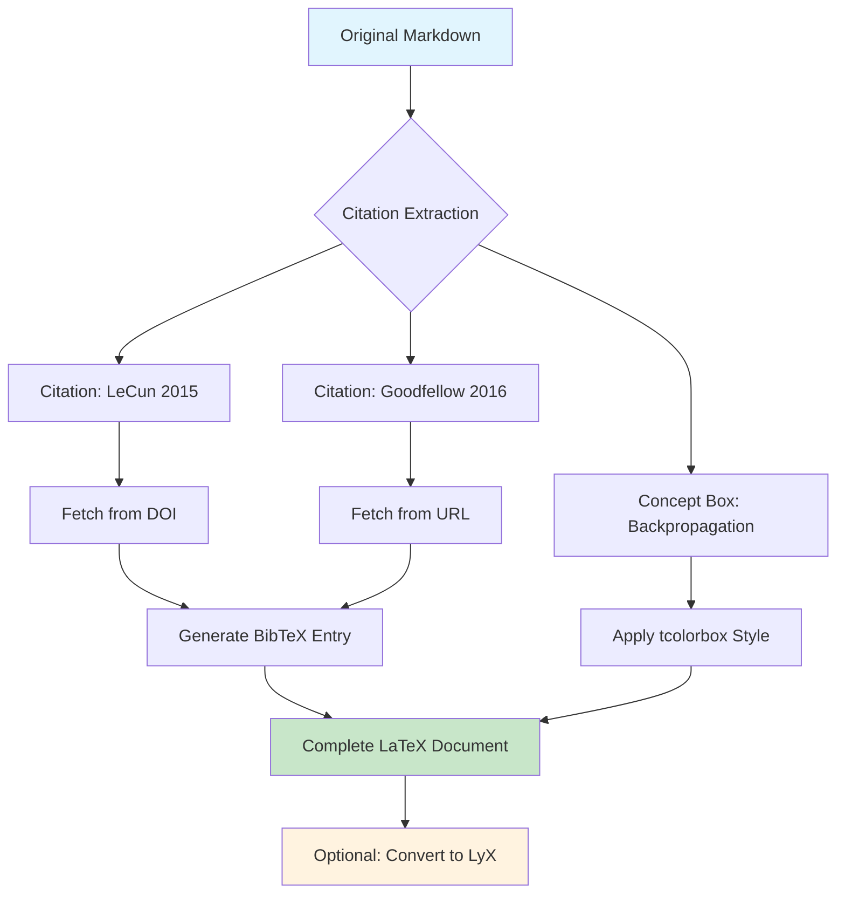

# Conversion Example

This document shows a complete example of converting an academic markdown document through various formats.

## Input: Markdown Document

```markdown
# Research on Neural Networks

According to [LeCun et al. (2015)](https://doi.org/10.1038/nature14539),
deep learning has revolutionized AI.

*Technical Concept Box: Backpropagation*
Backpropagation is the key algorithm for training neural networks.
It efficiently computes gradients using the chain rule.

The work by [Goodfellow et al. (2016)](http://www.deeplearningbook.org/)
provides comprehensive coverage of deep learning techniques.
```

## Step 1: Convert to LaTeX

```bash
deep-biblio-md2latex research.md --output-dir latex/
```

### Generated LaTeX Output

```latex
\documentclass[11pt,a4paper,twocolumn]{article}
\usepackage[utf8]{inputenc}
\usepackage{geometry}
\geometry{top=0.75in, bottom=0.75in, left=0.75in, right=0.75in, columnsep=0.25in}
\usepackage{tcolorbox}
\usepackage[backend=biber,style=numeric,sorting=none]{biblatex}
\addbibresource{references.bib}

\newtcolorbox{conceptbox}[1][]{
  colback=blue!5!white,
  colframe=blue!75!black,
  fonttitle=\bfseries,
  title=#1
}

\begin{document}

\section{Research on Neural Networks}

According to \cite{lecun2015deep}, deep learning has revolutionized AI.

\begin{conceptbox}[Backpropagation]
Backpropagation is the key algorithm for training neural networks.
It efficiently computes gradients using the chain rule.
\end{conceptbox}

The work by \cite{goodfellow2016deep} provides comprehensive coverage
of deep learning techniques.

\printbibliography

\end{document}
```

### Generated BibTeX File

```bibtex
@article{lecun2015deep,
  title={Deep learning},
  author={LeCun, Yann and Bengio, Yoshua and Hinton, Geoffrey},
  journal={Nature},
  volume={521},
  number={7553},
  pages={436--444},
  year={2015},
  publisher={Nature Publishing Group}
}

@book{goodfellow2016deep,
  title={Deep Learning},
  author={Goodfellow, Ian and Bengio, Yoshua and Courville, Aaron},
  year={2016},
  publisher={MIT Press}
}
```

## Step 2: Convert to LyX

```bash
# From Markdown
deep-biblio-to-lyx from-markdown research.md

# From LaTeX
deep-biblio-to-lyx from-tex latex/research.tex
```

The LyX output allows visual editing while maintaining the LaTeX structure.

## Conversion Flow Diagram



## Features Demonstrated

1. **Automatic Citation Processing**
   - Extracts citations from markdown links
   - Fetches metadata from URLs/DOIs
   - Generates proper BibTeX entries

2. **Concept Box Conversion**
   - Detects special markdown format
   - Converts to LaTeX tcolorbox environment
   - Maintains formatting and structure

3. **Academic Formatting**
   - Two-column layout by default
   - Proper margins for academic papers
   - Bibliography management with biblatex

4. **Format Flexibility**
   - Can output to LaTeX for submission
   - Can convert to LyX for visual editing
   - Preserves all academic elements
