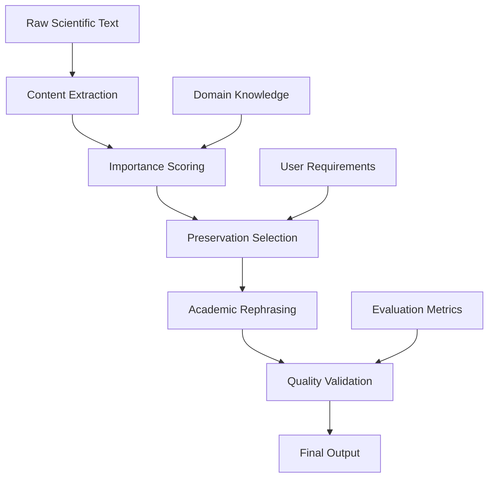

# Synthesis of Scientific Summarization and Rephrasing Approaches

## Executive Summary

This document synthesizes learnings from recent research on scientific text summarization, rephrasing, and evaluation techniques. Through analysis of multiple state-of-the-art approaches, we identify key challenges and best practices for developing systems that can effectively process academic literature while maintaining technical accuracy and avoiding common pitfalls.

## Key Challenges in Scientific Text Processing

### 1. Generalization Bias in LLM Summarization

**[Generalization bias in large language model summarization of scientific research](https://royalsocietypublishing.org/doi/10.1098/rsos.241776)** (Peters & Chin-Yee, 2025) identifies a critical issue: LLMs tend to overgeneralize when summarizing scientific content, leading to loss of specific technical details and nuanced findings.

Key findings:
- LLMs frequently replace specific technical terms with broader categories
- Quantitative results often get simplified or omitted
- Important caveats and limitations may be lost in summarization
- The bias is consistent across different LLM architectures

**Implications for our approach:**
- Implement explicit preservation mechanisms for technical terms
- Prioritize retention of quantitative metrics and specific results
- Ensure limitations and caveats receive high preservation scores
- Use structured approaches to maintain specificity

### 2. Evaluation Challenges

**[Advanced Techniques in Evaluating LLM Text Summarization](https://www.deepchecks.com/advanced-techniques-evaluating-llm-text-summarization/)** emphasizes that traditional evaluation metrics like ROUGE scores are insufficient for scientific content. The paper advocates for:

- **Extrinsic evaluation**: Measuring practical value for downstream tasks
- **Semantic coherence**: Ensuring logical flow is maintained
- **Information preservation**: Verifying critical facts aren't lost
- **Task-specific metrics**: Customizing evaluation for scientific domains

### 3. Structured Approaches to Scientific Summarization

**[Can LLMs Generate Tabular Summaries of Science Papers?](https://arxiv.org/abs/2504.10284)** (Wang et al., 2024) demonstrates the value of structured representations:

- Tabular formats help preserve relationships between concepts
- Structured summaries are more useful for comparison across papers
- User prompts are often under-specified, requiring intelligent defaults
- Retrieved papers frequently contain irrelevant content requiring filtering

**[Evaluating Large Language Models for Structured Science Summarization in the Open Research Knowledge Graph](https://arxiv.org/abs/2405.02105)** shows:
- Property-based representations enhance findability
- LLMs can suggest relevant research dimensions
- Fine-tuning improves alignment with scientific tasks
- Human expertise remains crucial for validation

## Best Practices for Scientific Text Processing

### 1. Content Preservation Strategies

Based on the synthesis of approaches, effective preservation requires:

```python
preservation_hierarchy = {
    "critical": {
        "future_work": 0.95-1.0,
        "limitations": 0.90-0.95,
        "quantitative_results": 0.85-0.90,
        "methodology": 0.70-0.85,
        "novel_contributions": 0.80-0.90
    },
    "important": {
        "discussion": 0.60-0.70,
        "experimental_setup": 0.50-0.65,
        "abstract": 0.60-0.75
    },
    "contextual": {
        "related_work": 0.20-0.40,
        "introduction": 0.30-0.50,
        "background": 0.20-0.35
    }
}
```

### 2. Prompt Engineering for Scientific Summarization

**[An Evaluation of Large Language Models on Text Summarization Tasks Using Prompt Engineering Techniques](https://arxiv.org/abs/2507.05123)** (2025) provides critical insights:

- Specific prompts outperform generic ones by 15-30%
- Multi-stage prompting improves content preservation
- Role-based prompts ("As a domain expert...") enhance quality
- Explicit constraints prevent over-generalization

Effective prompt template:
```
As a scientific reviewer specializing in [DOMAIN], create a comprehensive
summary that:
1. Preserves ALL quantitative results and metrics
2. Maintains technical terminology without simplification
3. Retains 100% of future work and limitations
4. Uses formal academic prose style
5. Targets [X]% content retention
```

### 3. Low-Resource and Domain-Specific Approaches

**[A Guide To Effectively Leveraging LLMs for Low-Resource Text Summarization](https://arxiv.org/abs/2407.07341)** (2024) offers strategies for specialized domains:

- **Data Augmentation**: Generate synthetic training data from existing papers
- **Semi-supervised Learning**: Combine limited labeled data with unlabeled corpus
- **Transfer Learning**: Adapt general models to specific scientific domains
- **Active Learning**: Iteratively improve with minimal human annotation

### 4. Comprehensive Survey Insights

**[AI4Research: A Survey of Artificial Intelligence for Scientific Research](https://arxiv.org/abs/2507.01903)** (2025) provides broader context:

- Scientific text processing is evolving from keyword-based to semantic understanding
- Multi-modal approaches (text + figures + tables) show promise
- Domain-specific models outperform general-purpose ones
- Human-in-the-loop systems achieve best results

## Recommended Architecture for Scientific Rephrasing

Based on the synthesized learnings, an effective system should incorporate:

### 1. Multi-Stage Processing Pipeline



### 2. Importance Scoring Algorithm

```python
def calculate_importance_score(sentence, section_context, domain_keywords):
    """
    Multi-factor importance scoring based on research synthesis.
    """
    score = 0.5  # Base score

    # Technical content (prevents generalization bias)
    if contains_quantitative_results(sentence):
        score += 0.3
    if contains_technical_terms(sentence, domain_keywords):
        score += 0.2

    # Structural importance
    if is_first_or_last_sentence(sentence, section_context):
        score += 0.1
    if contains_contribution_markers(sentence):
        score += 0.15

    # Critical sections (from preservation hierarchy)
    if section_context in ['future_work', 'limitations']:
        score = max(score, 0.9)

    return min(score, 1.0)
```

### 3. Evaluation Framework

Combining insights from multiple papers:

1. **Intrinsic Metrics**:
   - Preservation rate of technical terms
   - Retention of quantitative results
   - Maintenance of logical flow

2. **Extrinsic Metrics**:
   - Usefulness for literature review
   - Accuracy in answering domain questions
   - Comparison effectiveness

3. **Human Evaluation**:
   - Expert assessment of content accuracy
   - Readability and coherence
   - Completeness of preserved information

## Practical Implementation Guidelines

### 1. Avoiding Common Pitfalls

- **Over-compression**: Target 25-30% retention minimum for meaningful summaries
- **Generalization**: Explicitly preserve technical specificity
- **Context Loss**: Maintain section-level coherence
- **Citation Corruption**: Preserve all bibliographic information

### 2. Quality Assurance Checklist

- [ ] No text artifacts from HTML parsing
- [ ] All quantitative results preserved
- [ ] Future work sections 95%+ preserved
- [ ] Technical terms maintained without simplification
- [ ] Academic prose style consistent
- [ ] Citations properly formatted and linked
- [ ] Logical flow between sections maintained

### 3. Domain Adaptation

For specific domains (e.g., BIM/construction):
- Build domain-specific keyword lists
- Adjust preservation ratios based on domain conventions
- Include domain-relevant context in all outputs
- Validate with domain experts

## Conclusion

Effective scientific text summarization requires a careful balance between compression and preservation. By synthesizing insights from recent research, we identify that successful systems must:

1. Combat generalization bias through explicit preservation mechanisms
2. Use structured approaches to maintain information relationships
3. Apply sophisticated evaluation beyond surface-level metrics
4. Adapt to domain-specific requirements and conventions
5. Incorporate human expertise in the loop

The key insight is that scientific summarization is not merely about reducing text length, but about intelligently preserving the essence of research while making it more accessible and useful for specific applications.

## References

1. Peters, U., & Chin-Yee, B. (2025). [Generalization bias in large language model summarization of scientific research](https://royalsocietypublishing.org/doi/10.1098/rsos.241776). Royal Society Open Science.

2. Wang, W., et al. (2024). [Can LLMs Generate Tabular Summaries of Science Papers? Rethinking the Evaluation Protocol](https://arxiv.org/abs/2504.10284). arXiv preprint.

3. Newman, B., et al. (2024). [Evaluating Large Language Models for Structured Science Summarization in the Open Research Knowledge Graph](https://arxiv.org/abs/2405.02105). Proceedings of EMNLP 2024.

4. [An Evaluation of Large Language Models on Text Summarization Tasks Using Prompt Engineering Techniques](https://arxiv.org/abs/2507.05123). (2025). arXiv preprint.

5. [A Guide To Effectively Leveraging LLMs for Low-Resource Text Summarization: Data Augmentation and Semi-supervised Approaches](https://arxiv.org/abs/2407.07341). (2024). arXiv preprint.

6. [AI4Research: A Survey of Artificial Intelligence for Scientific Research](https://arxiv.org/abs/2507.01903). (2025). arXiv preprint.

7. [Advanced Techniques in Evaluating LLM Text Summarization: A Comprehensive Guide](https://www.deepchecks.com/advanced-techniques-evaluating-llm-text-summarization/). (2024). Deepchecks.

8. Reddit Discussion: [Summarizing scientific papers effectively](https://www.reddit.com/r/LocalLLaMA/). Community insights on practical challenges.
