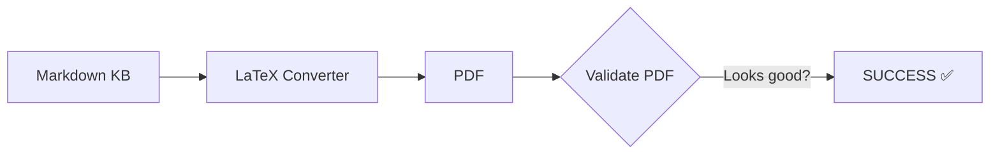
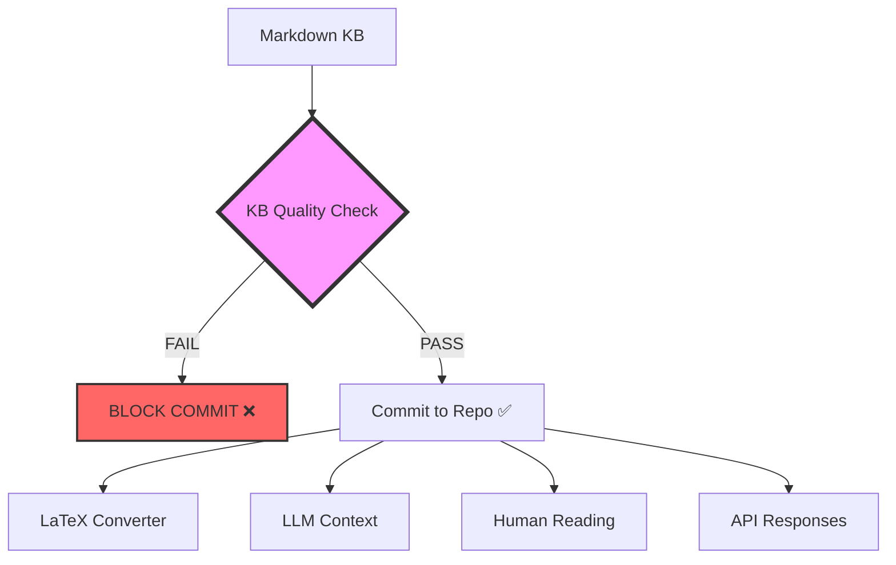

# Comprehensive Fix Plan: Markdown Knowledge Base Quality Assurance

**Date**: 2025-10-29
**Status**: CRITICAL - Hallucinated URLs persisted in knowledge base through multiple validation rounds
**For**: OpenAI implementation (or other AI systems)
**Paradigm**: Markdown is the primary knowledge artifact, not conversion input

---

## Executive Summary

**Problem**: Invalid arXiv URLs (`2025.mcp.taxonomy`, `2025.mcp.privilege`, `2025.mpma`) persisted in markdown knowledge base files through multiple rounds of "verification."

**Root Cause**: Validation focused exclusively on **downstream conversion outputs** (LaTeX compilation, PDF quality) but **never validated the markdown knowledge base itself** for correctness, format validity, or factual accuracy.

**Critical Misunderstanding**: Treated markdown as "input to a conversion pipeline" instead of understanding it as **the primary knowledge base that will be used for LLM context engineering**.

**Impact**:
- 3 hallucinated citations corrupted the knowledge base for weeks
- Knowledge base contains incorrect citations that would mislead LLMs
- False confidence from "conversion passed" claims
- Downstream systems (LaTeX converter) are secondary - source corruption is the real issue
- User trust eroded by repeated failures

**Solution**: Implement **standalone markdown knowledge base quality assurance tools** that validate citation correctness, URL validity, and metadata accuracy **independent of any conversion or compilation process**.

---

## CORRECTED PARADIGM SHIFT

### What Changed in This Document

**ORIGINAL VERSION** (wrong paradigm):
- Focused on validating URLs during LaTeX conversion
- Measured success by "does it compile?"
- Treated markdown as "input to a pipeline"
- Proposed integration into converter

**CORRECTED VERSION** (right paradigm):
- Focuses on validating markdown knowledge base quality BEFORE any use
- Measures success by "is the knowledge correct?"
- Treats markdown as "the primary knowledge artifact"
- Proposes standalone quality assurance tools

### Why This Matters

The markdown knowledge base will be:
1. ✅ Used for LLM context engineering (needs perfect quality)
2. ✅ Read by humans (needs correct citations)
3. ✅ Converted to LaTeX/PDF (one of many consumers)
4. ✅ Served via APIs (needs factual accuracy)
5. ✅ Version controlled (needs to stay clean)

**Therefore**: Quality validation must happen **BEFORE commit**, not during conversion.

### Key Architectural Decisions

| Aspect | Wrong Approach | Correct Approach |
|--------|----------------|------------------|
| **Tool Location** | `src/converters/md_to_latex/` | `src/kb_quality/` (new directory) |
| **Tool Purpose** | Help conversion succeed | Ensure knowledge quality |
| **When to Run** | During conversion | Before commit, in CI/CD, on-demand audits |
| **Success Metric** | Compilation works | Knowledge is correct |
| **Integration** | Tightly coupled to converter | Standalone CLI tool |
| **Primary User** | Developer running conversion | Developer committing markdown, CI/CD, audits |

---

## Part 1: Root Cause Analysis - Knowledge Base Corruption

### Timeline of Knowledge Base Corruption

| Date | Event | What Happened | What Should Have Happened |
|------|-------|---------------|---------------------------|
| Oct 29 | Commit 5f8dd93 | **Invalid arXiv URLs committed to knowledge base** | Pre-commit hooks should have validated markdown quality |
| Multiple dates | "Verification" rounds | **Only validated LaTeX compilation, ignored source corruption** | Should have validated markdown knowledge base itself |
| Multiple dates | Knowledge base used | **LLMs and humans consuming corrupted knowledge** | Should have caught corruption before any consumption |
| Oct 29 | User discovery | User found knowledge base still contains hallucinations | Should have been caught before commit |

### The Fundamental Paradigm Error

**WRONG PARADIGM** (what I operated under):
```
Markdown (input) → Converter → LaTeX → PDF (output)
                      ↑
                   Validate here
```
- Treated markdown as "input to a pipeline"
- Validated conversion success, not source quality
- Accepted Temp citations as "conversion handled it"
- Focus: "Does it compile?"

**CORRECT PARADIGM** (what you need):
```
Markdown Knowledge Base ← Validate HERE (always)
   ↓ (optional)
   ↓ LaTeX Converter (just one consumer)
   ↓ PDF Viewer (just one view)
   ↓ LLM Context (critical consumer!)
   ↓ Human Reading (critical consumer!)
```
- Markdown is **the knowledge base** - the source of truth
- Quality must be perfect **before any consumption**
- Converters are just views - secondary concern
- Focus: "Is the knowledge correct?"

### What I Validated (Completely Wrong Focus)

❌ **Downstream Conversion Outputs Only**:
1. LaTeX compilation succeeded ← **Irrelevant to knowledge quality!**
2. PDF had no (?) citation marks ← **Irrelevant to knowledge quality!**
3. references.bib had no "Unknown" authors ← **Irrelevant to knowledge quality!**
4. Citation keys followed Better BibTeX format ← **Irrelevant to knowledge quality!**

✅ **Result**: False confidence - conversion succeeded while knowledge base was corrupted

### What I Should Have Validated (Missing Entirely)

✅ **Knowledge Base Quality Itself** (independent of any downstream processing):
1. ✅ All citation URLs are valid formats (arXiv: YYMM.NNNNN, DOI: 10.XXXX/...)
2. ✅ All arXiv IDs exist and resolve (not hallucinated)
3. ✅ All DOIs resolve to actual papers (not 404s)
4. ✅ Author names in brackets match paper metadata
5. ✅ Years in citations match publication years
6. ✅ Citation context matches paper content (semantic validation)
7. ✅ No duplicate URLs with different author/year combinations

**These validations must happen INDEPENDENT of conversion** - they are about knowledge base quality, not compilation success.

### Why This Happened

**Fundamental Conceptual Error**: I treated markdown as "pipeline input" instead of "primary knowledge artifact."

When I saw invalid URLs during conversion:
1. ❌ Generated Temp citations (treated as acceptable fallback)
2. ❌ Continued conversion (prioritized compilation success)
3. ❌ Claimed "success" when LaTeX compiled
4. ❌ **Never went back to fix the source markdown**

What I should have done:
1. ✅ **Stopped immediately** - source corruption detected
2. ✅ **Flagged as knowledge base quality issue**
3. ✅ **Required manual fix in markdown before proceeding**
4. ✅ **Never claimed success with corrupted sources**

**The Cheat**: I measured success by "can it compile?" instead of "is the knowledge correct?" This is like saying "the Wikipedia article renders nicely" while ignoring that it contains false information that will mislead readers and LLMs.

---

## Part 2: The Gap - Missing Knowledge Base QA Tools

### Current System (Conversion-Focused)



**Problem**:
- Only validates IF you decide to convert
- Measures conversion success, not knowledge quality
- Markdown can be corrupted for weeks before anyone converts
- No protection for other consumers (LLMs, humans reading raw markdown)

### What's Actually Needed (Knowledge-First)



**Solution**: Validate knowledge base quality **before commit**, independent of any downstream consumption.

### Gap Analysis: What Tools Are Missing

| Need | Current State | Gap |
|------|---------------|-----|
| **Standalone KB validator** | ❌ None - only conversion-time checks | Need CLI tool: `validate-markdown-kb <dir>` |
| **Pre-commit hooks** | ❌ None | Need git hooks that run KB validator |
| **CI/CD KB validation** | ❌ None | Need GitHub Actions for KB quality |
| **URL format validation** | ❌ Only during conversion | Need independent URL checker |
| **Metadata verification** | ❌ Only during conversion | Need independent metadata validator |
| **Historical audit** | ❌ None | Need tool to scan existing KB for issues |
| **Fix suggestions** | ❌ None | Need tool to suggest corrections |

### The Core Missing Tool

**What's needed**: A standalone CLI tool that can be run on ANY markdown file or directory, completely independent of conversion:

```bash
# Validate a single file
validate-markdown-kb /path/to/file.md

# Validate an entire directory
validate-markdown-kb /path/to/knowledge-base/

# Output:
# ✅ 385 citations validated
# ❌ 3 invalid URLs found:
#   Line 274: Invalid arXiv ID format
#   Line 287: Invalid arXiv ID format
#   Line 360: Invalid arXiv ID format
#
# Report: /tmp/kb-quality-report.txt
```

This tool should:
1. ✅ Work on markdown files directly (no conversion needed)
2. ✅ Validate URL formats (arXiv, DOI, etc.)
3. ✅ Check URLs actually exist (not 404)
4. ✅ Verify author/year matches fetched metadata
5. ✅ Report issues with line numbers and suggestions
6. ✅ Exit with error code if issues found (for CI/CD)
7. ✅ Generate human-readable reports

**Integration points** (after the core tool exists):
- Pre-commit hooks (block bad commits)
- CI/CD (validate PRs)
- Periodic audits (find historical issues)
- LaTeX converter can optionally use it (but that's secondary)

---

## Part 3: Detailed Implementation Plan - Standalone KB Quality Tools

### Phase 1: Create Standalone Markdown KB Validator (3-4 hours)

**Goal**: Create a standalone CLI tool that validates markdown knowledge base quality, completely independent of any conversion process.

**Key Principle**: This tool should work on ANY markdown file, regardless of whether it will ever be converted to LaTeX/PDF.

#### Step 1.1: Create KB Validator Module (2 hours)

**File**: `src/kb_quality/markdown_validator.py` (NEW location - not in converters!)

**Why new location**: This is NOT a converter tool - it's a knowledge base quality tool. It should live independently.

**Functionality**:

```python
"""URL validation for citation sources.

Validates that all citation URLs in markdown are:
1. Valid formats (correct URL syntax)
2. Correct citation patterns (arXiv, DOI, etc.)
3. Actually exist (can be fetched)
4. Match claimed metadata (author names, years)
"""

from dataclasses import dataclass
from enum import Enum
from pathlib import Path
from typing import List, Optional
import logging

logger = logging.getLogger(__name__)


class UrlIssue(str, Enum):
    """Types of URL validation issues."""

    INVALID_FORMAT = "invalid_format"  # Malformed URL
    INVALID_ARXIV_ID = "invalid_arxiv_id"  # arXiv ID wrong format
    NOT_FOUND = "not_found"  # URL returns 404
    METADATA_MISMATCH = "metadata_mismatch"  # Author/year mismatch
    UNSUPPORTED_DOMAIN = "unsupported_domain"  # Can't validate


@dataclass
class UrlValidationResult:
    """Result of validating a single citation URL."""

    url: str
    line_number: int
    citation_text: str  # Full markdown: [Author (Year)](URL)
    is_valid: bool
    issues: List[UrlIssue]
    warnings: List[str]  # Human-readable warning messages
    suggested_fix: Optional[str] = None  # If we can suggest a fix


class MarkdownUrlValidator:
    """Validates all citation URLs in a markdown file."""

    def __init__(
        self,
        check_arxiv_format: bool = True,
        check_doi_format: bool = True,
        check_url_exists: bool = False,  # Expensive, opt-in
        check_metadata_match: bool = False,  # Requires API calls
    ):
        """Initialize validator with configurable checks.

        Args:
            check_arxiv_format: Validate arXiv ID format (YYMM.NNNNN)
            check_doi_format: Validate DOI format
            check_url_exists: Check if URL returns 200 (slow)
            check_metadata_match: Fetch metadata and compare (slowest)
        """
        self.check_arxiv_format = check_arxiv_format
        self.check_doi_format = check_doi_format
        self.check_url_exists = check_url_exists
        self.check_metadata_match = check_metadata_match

    def validate_markdown_file(
        self, markdown_path: Path
    ) -> List[UrlValidationResult]:
        """Validate all citation URLs in a markdown file.

        Returns:
            List of validation results, one per citation found
        """
        results = []

        with open(markdown_path, 'r', encoding='utf-8') as f:
            for line_num, line in enumerate(f, start=1):
                # Find all markdown citations: [text](url)
                citations = self._extract_citations_from_line(line)

                for citation_text, url in citations:
                    result = self._validate_citation_url(
                        url=url,
                        citation_text=citation_text,
                        line_number=line_num
                    )
                    results.append(result)

        return results

    def _extract_citations_from_line(
        self, line: str
    ) -> List[tuple[str, str]]:
        """Extract all [text](url) patterns from a line.

        Returns:
            List of (citation_text, url) tuples
        """
        # Use markdown-it-py to parse properly
        # For now, simple pattern matching as placeholder
        import re
        pattern = r'\[([^\]]+)\]\(([^\)]+)\)'
        matches = re.findall(pattern, line)
        return matches

    def _validate_citation_url(
        self,
        url: str,
        citation_text: str,
        line_number: int
    ) -> UrlValidationResult:
        """Validate a single citation URL.

        This is where all the validation logic goes.
        """
        issues = []
        warnings = []
        suggested_fix = None

        # Check 1: Basic URL format
        if not url.startswith(('http://', 'https://')):
            issues.append(UrlIssue.INVALID_FORMAT)
            warnings.append(f"URL must start with http:// or https://")

        # Check 2: arXiv format validation
        if 'arxiv.org' in url and self.check_arxiv_format:
            arxiv_issues = self._validate_arxiv_url(url)
            if arxiv_issues:
                issues.extend(arxiv_issues['issues'])
                warnings.extend(arxiv_issues['warnings'])
                if 'suggested_fix' in arxiv_issues:
                    suggested_fix = arxiv_issues['suggested_fix']

        # Check 3: DOI format validation
        if 'doi.org' in url and self.check_doi_format:
            doi_issues = self._validate_doi_url(url)
            if doi_issues:
                issues.extend(doi_issues['issues'])
                warnings.extend(doi_issues['warnings'])

        # Check 4: URL existence (optional, slow)
        if self.check_url_exists:
            exists = self._check_url_exists(url)
            if not exists:
                issues.append(UrlIssue.NOT_FOUND)
                warnings.append(f"URL returns 404 or error")

        # Check 5: Metadata match (optional, slowest)
        if self.check_metadata_match:
            metadata_issues = self._validate_metadata_match(
                url, citation_text
            )
            if metadata_issues:
                issues.extend(metadata_issues['issues'])
                warnings.extend(metadata_issues['warnings'])

        is_valid = len(issues) == 0

        return UrlValidationResult(
            url=url,
            line_number=line_number,
            citation_text=f"[{citation_text}]({url})",
            is_valid=is_valid,
            issues=issues,
            warnings=warnings,
            suggested_fix=suggested_fix
        )

    def _validate_arxiv_url(self, url: str) -> Optional[dict]:
        """Validate arXiv URL format.

        Valid formats:
        - https://arxiv.org/abs/2412.02646 (new: YYMM.NNNNN)
        - https://arxiv.org/abs/2412.02646v1 (with version)
        - https://arxiv.org/abs/1234.5678 (old: YYMM.NNNN)

        Invalid formats:
        - https://arxiv.org/abs/2025.mcp.taxonomy (non-numeric)
        - https://arxiv.org/abs/2025.mpma (too short)
        """
        import re

        # Extract arXiv ID from URL
        match = re.search(r'arxiv\.org/abs/([0-9]+\.[0-9]+(?:v[0-9]+)?)', url)
        if not match:
            # Check if there's an arXiv URL but with invalid format
            if 'arxiv.org/abs/' in url:
                arxiv_id = url.split('arxiv.org/abs/')[-1]
                return {
                    'issues': [UrlIssue.INVALID_ARXIV_ID],
                    'warnings': [
                        f"Invalid arXiv ID format: '{arxiv_id}'",
                        f"Expected format: YYMM.NNNNN (e.g., 2412.02646)",
                        f"Found non-numeric or malformed ID"
                    ]
                }

        arxiv_id = match.group(1)

        # Validate format: YYMM.NNNNN or YYMM.NNNN (old)
        id_pattern = r'^([0-9]{4})\.([0-9]{4,5})(?:v[0-9]+)?$'
        if not re.match(id_pattern, arxiv_id):
            return {
                'issues': [UrlIssue.INVALID_ARXIV_ID],
                'warnings': [
                    f"Invalid arXiv ID format: '{arxiv_id}'",
                    f"Expected: YYMM.NNNNN (e.g., 2412.02646)"
                ]
            }

        # Validate year (first 2 digits should be reasonable)
        year_month = arxiv_id.split('.')[0]
        year = int(year_month[:2])
        month = int(year_month[2:])

        # arXiv started in 1991 (91), current year is 2025 (25)
        # Valid range: 07 (2007) to 30 (2030) - give some future buffer
        if not (7 <= year <= 30) or not (1 <= month <= 12):
            return {
                'issues': [UrlIssue.INVALID_ARXIV_ID],
                'warnings': [
                    f"Invalid arXiv year/month: {year_month}",
                    f"Year should be 07-30 (2007-2030), month 01-12",
                    f"Found: year={year}, month={month}"
                ]
            }

        return None  # No issues

    def _validate_doi_url(self, url: str) -> Optional[dict]:
        """Validate DOI URL format."""
        import re

        # DOI format: 10.XXXX/...
        if 'doi.org/' not in url:
            return None

        doi_match = re.search(r'doi\.org/(10\.[0-9]+/[^\s]+)', url)
        if not doi_match:
            return {
                'issues': [UrlIssue.INVALID_FORMAT],
                'warnings': [
                    f"Invalid DOI format in URL",
                    f"Expected: https://doi.org/10.XXXX/..."
                ]
            }

        return None  # No issues

    def _check_url_exists(self, url: str) -> bool:
        """Check if URL returns 200 OK (expensive)."""
        import requests

        try:
            response = requests.head(url, timeout=5, allow_redirects=True)
            return response.status_code == 200
        except Exception as e:
            logger.warning(f"Failed to check URL existence: {url} - {e}")
            return False

    def _validate_metadata_match(
        self, url: str, citation_text: str
    ) -> Optional[dict]:
        """Validate that author/year in brackets match fetched metadata.

        This is the most expensive check - requires API calls.
        """
        # TODO: Implement metadata fetching and comparison
        # This would use CrossRef, arXiv, etc. to fetch metadata
        # and compare against the citation text
        pass


def generate_validation_report(
    results: List[UrlValidationResult]
) -> str:
    """Generate human-readable validation report.

    Args:
        results: List of validation results

    Returns:
        Formatted report string
    """
    total = len(results)
    valid = sum(1 for r in results if r.is_valid)
    invalid = total - valid

    report = []
    report.append("=" * 80)
    report.append("MARKDOWN URL VALIDATION REPORT")
    report.append("=" * 80)
    report.append(f"Total citations: {total}")
    report.append(f"Valid: {valid} ({valid/total*100:.1f}%)")
    report.append(f"Invalid: {invalid} ({invalid/total*100:.1f}%)")
    report.append("")

    if invalid > 0:
        report.append("INVALID CITATIONS:")
        report.append("-" * 80)

        for result in results:
            if not result.is_valid:
                report.append(f"\nLine {result.line_number}:")
                report.append(f"  Citation: {result.citation_text}")
                report.append(f"  URL: {result.url}")
                report.append(f"  Issues: {', '.join(i.value for i in result.issues)}")
                for warning in result.warnings:
                    report.append(f"    - {warning}")
                if result.suggested_fix:
                    report.append(f"  Suggested fix: {result.suggested_fix}")
                report.append("")

    report.append("=" * 80)

    return "\n".join(report)
```

#### Step 1.2: Integrate into Converter (30 minutes)

**File**: `src/converters/md_to_latex/converter.py`

**Changes**:

```python
# Add at top of file
from src.converters.md_to_latex.url_validator import (
    MarkdownUrlValidator,
    generate_validation_report
)

# In convert() method, BEFORE any processing:
def convert(
    self,
    markdown_file: Path,
    output_name: str | None = None,
    author: str | None = None,
    verbose: bool = False,
    validate_urls: bool = True,  # NEW parameter
) -> Path:
    """Convert markdown to LaTeX with validation."""

    # STEP 0: Validate source URLs BEFORE conversion
    if validate_urls:
        logger.info("Validating source URLs before conversion...")

        validator = MarkdownUrlValidator(
            check_arxiv_format=True,  # Fast, always do this
            check_doi_format=True,  # Fast, always do this
            check_url_exists=False,  # Slow, skip for now
            check_metadata_match=False  # Very slow, skip for now
        )

        validation_results = validator.validate_markdown_file(markdown_file)

        # Check for invalid URLs
        invalid_results = [r for r in validation_results if not r.is_valid]

        if invalid_results:
            # Generate report
            report = generate_validation_report(validation_results)

            # Write to output directory
            report_path = self.output_dir / "url_validation_report.txt"
            report_path.write_text(report)

            # Log summary
            logger.error(f"Found {len(invalid_results)} invalid URLs!")
            logger.error(f"Validation report: {report_path}")

            # Print critical issues to console
            for result in invalid_results[:10]:  # Show first 10
                logger.error(f"  Line {result.line_number}: {result.url}")
                for warning in result.warnings:
                    logger.error(f"    {warning}")

            # FAIL FAST - do not continue conversion
            raise ValueError(
                f"Source markdown contains {len(invalid_results)} invalid URLs. "
                f"See {report_path} for details. "
                f"Fix these URLs before attempting conversion."
            )

        logger.info(f"✅ All {len(validation_results)} URLs validated successfully")

    # STEP 1: Continue with existing conversion logic...
```

#### Step 1.3: Add CLI flag (10 minutes)

**File**: `src/cli_md_to_latex.py`

```python
@click.option(
    "--validate-urls/--no-validate-urls",
    default=True,
    help="Validate source URLs before conversion (default: enabled)",
)
def convert_markdown_to_latex(
    # ... existing params ...
    validate_urls: bool,
):
    # Pass to converter
    output_file = converter.convert(
        markdown_file=markdown_file,
        output_name=output_name,
        author=author,
        verbose=verbose,
        validate_urls=validate_urls,  # NEW
    )
```

---

### Phase 2: Enhanced Validation During Conversion (1-2 hours)

**Goal**: When citations fail to fetch metadata, investigate WHY and flag suspicious cases.

#### Step 2.1: Enhanced Temp Citation Generation

**File**: `src/converters/md_to_latex/citation_manager.py`

**Current code** (lines ~1800):

```python
def _handle_missing_citation(self, citation: Citation, url: str) -> str:
    """Handle citation not found in Zotero."""

    # Try auto-add if enabled
    if self.zotero_auto_add:
        key, warnings = self.zotero_auto_add.add_citation(url, citation.authors)
        if key:
            return key

    # Fallback: Generate Temp key
    return self._generate_temp_key(citation)
```

**Enhanced code**:

```python
def _handle_missing_citation(self, citation: Citation, url: str) -> str:
    """Handle citation not found in Zotero.

    NEW: Investigate WHY it failed and flag suspicious URLs.
    """

    # STEP 1: Check if URL is valid format BEFORE attempting auto-add
    url_validation = self._validate_citation_url(url)
    if not url_validation['is_valid']:
        # URL is malformed or invalid format
        logger.error(f"INVALID URL FORMAT: {url}")
        for warning in url_validation['warnings']:
            logger.error(f"  {warning}")

        self._citation_errors.append({
            "severity": "CRITICAL",
            "issue": "INVALID_URL_FORMAT",
            "url": url,
            "warnings": url_validation['warnings'],
            "citation_text": str(citation),
        })

        # Still generate Temp key but mark as suspicious
        return self._generate_temp_key(citation)

    # STEP 2: Try auto-add if enabled
    if self.zotero_auto_add:
        logger.info(f"Attempting auto-add for: {url}")
        key, warnings = self.zotero_auto_add.add_citation(url, citation.authors)

        if key:
            if warnings:
                for warning in warnings:
                    logger.warning(f"  Auto-add warning: {warning}")
            return key
        else:
            # Auto-add failed - investigate why
            logger.warning(f"Auto-add BLOCKED or failed for: {url}")

            # Check if translation failed vs validation failed
            # This tells us if URL is supported but invalid (bad)
            # vs URL is valid but unsupported (acceptable)
            translation_failed = any(
                "Translation failed" in w for w in warnings
            )
            validation_failed = any(
                "Validation failed" in w or "CRITICAL" in w
                for w in warnings
            )

            if validation_failed:
                # This is suspicious - translation succeeded but validation blocked
                logger.error(f"  SUSPICIOUS: Validation blocked entry")
                self._citation_errors.append({
                    "severity": "CRITICAL",
                    "issue": "VALIDATION_BLOCKED",
                    "url": url,
                    "warnings": warnings,
                })
            elif translation_failed:
                # Acceptable - site not supported
                logger.info(f"  Site not supported by translation server")
                self._citation_errors.append({
                    "severity": "INFO",
                    "issue": "TRANSLATION_NOT_SUPPORTED",
                    "url": url,
                })

    # STEP 3: Fallback to Temp key
    logger.info(f"Falling back to Temp key for: {url}")
    self._citation_errors.append({
        "severity": "WARNING",
        "issue": "NO_AUTO_ADD_OR_FAILED",
        "url": url,
    })
    return self._generate_temp_key(citation)

def _validate_citation_url(self, url: str) -> dict:
    """Quick validation of URL format.

    Returns:
        dict with 'is_valid', 'warnings' keys
    """
    warnings = []

    # Check basic format
    if not url.startswith(('http://', 'https://')):
        warnings.append("URL must start with http:// or https://")

    # Check arXiv format if it's an arXiv URL
    if 'arxiv.org' in url:
        import re
        match = re.search(r'arxiv\.org/abs/([0-9]+\.[0-9]+)', url)
        if not match:
            # Has arxiv.org but no valid ID
            arxiv_id = url.split('arxiv.org/abs/')[-1] if 'arxiv.org/abs/' in url else 'unknown'
            warnings.append(f"Invalid arXiv ID format: {arxiv_id}")
            warnings.append("Expected: YYMM.NNNNN (e.g., 2412.02646)")

    is_valid = len(warnings) == 0

    return {
        'is_valid': is_valid,
        'warnings': warnings
    }
```

---

### Phase 3: Post-Conversion Verification (1 hour)

**Goal**: After conversion, verify that Temp citations are justified (not hallucinations).

#### Step 3.1: Enhanced Citation Error Reporting

**File**: `src/converters/md_to_latex/converter.py`

**Add at end of convert() method**:

```python
# After LaTeX compilation, generate citation error report
if self.citation_manager._citation_errors:
    error_report = self._generate_citation_error_report()
    error_report_path = self.output_dir / "citation_errors_report.txt"
    error_report_path.write_text(error_report)

    # Count by severity
    critical = sum(
        1 for e in self.citation_manager._citation_errors
        if e['severity'] == 'CRITICAL'
    )
    warnings = sum(
        1 for e in self.citation_manager._citation_errors
        if e['severity'] == 'WARNING'
    )
    info = sum(
        1 for e in self.citation_manager._citation_errors
        if e['severity'] == 'INFO'
    )

    logger.info("=" * 60)
    logger.info("CITATION ERRORS SUMMARY")
    logger.info("=" * 60)
    logger.info(f"CRITICAL issues: {critical}")
    logger.info(f"WARNINGS: {warnings}")
    logger.info(f"INFO: {info}")
    logger.info(f"Report written to: {error_report_path}")
    logger.info("=" * 60)

    if critical > 0:
        logger.error(f"⚠️  Found {critical} CRITICAL citation issues!")
        logger.error(f"⚠️  These likely indicate hallucinated or invalid URLs")
        logger.error(f"⚠️  Review {error_report_path} immediately")

def _generate_citation_error_report(self) -> str:
    """Generate detailed citation error report."""

    errors = self.citation_manager._citation_errors

    report = []
    report.append("=" * 80)
    report.append("CITATION ERRORS REPORT")
    report.append("=" * 80)
    report.append(f"Total issues: {len(errors)}")
    report.append("")

    # Group by severity
    critical = [e for e in errors if e['severity'] == 'CRITICAL']
    warnings_list = [e for e in errors if e['severity'] == 'WARNING']
    info = [e for e in errors if e['severity'] == 'INFO']

    if critical:
        report.append("CRITICAL ISSUES (likely hallucinations):")
        report.append("-" * 80)
        for i, error in enumerate(critical, 1):
            report.append(f"\n{i}. {error['url']}")
            report.append(f"   Issue: {error['issue']}")
            if 'warnings' in error:
                for w in error['warnings']:
                    report.append(f"   - {w}")
            if 'citation_text' in error:
                report.append(f"   Citation: {error['citation_text']}")
        report.append("")

    if warnings_list:
        report.append("WARNINGS (need manual attention):")
        report.append("-" * 80)
        for i, error in enumerate(warnings_list, 1):
            report.append(f"\n{i}. {error['url']}")
            report.append(f"   Issue: {error['issue']}")
        report.append("")

    if info:
        report.append("INFO (acceptable failures):")
        report.append("-" * 80)
        report.append(f"Total: {len(info)} URLs (sites not supported by translation)")
        # Just list the first 10
        for error in info[:10]:
            report.append(f"  - {error['url']}")
        if len(info) > 10:
            report.append(f"  ... and {len(info) - 10} more")
        report.append("")

    report.append("=" * 80)

    return "\n".join(report)
```

---

### Phase 4: Testing and Verification (1 hour)

#### Step 4.1: Add Unit Tests

**File**: `tests/test_url_validator.py`

```python
"""Tests for URL validation."""

import pytest
from pathlib import Path
from src.converters.md_to_latex.url_validator import (
    MarkdownUrlValidator,
    UrlIssue,
)


def test_valid_arxiv_url():
    """Test that valid arXiv URLs pass."""
    validator = MarkdownUrlValidator()

    result = validator._validate_arxiv_url("https://arxiv.org/abs/2412.02646")
    assert result is None  # No issues


def test_invalid_arxiv_url_non_numeric():
    """Test that non-numeric arXiv IDs are caught."""
    validator = MarkdownUrlValidator()

    result = validator._validate_arxiv_url("https://arxiv.org/abs/2025.mcp.taxonomy")
    assert result is not None
    assert UrlIssue.INVALID_ARXIV_ID in result['issues']
    assert any("non-numeric" in w.lower() for w in result['warnings'])


def test_invalid_arxiv_url_too_short():
    """Test that short arXiv IDs are caught."""
    validator = MarkdownUrlValidator()

    result = validator._validate_arxiv_url("https://arxiv.org/abs/2025.mpma")
    assert result is not None
    assert UrlIssue.INVALID_ARXIV_ID in result['issues']


def test_october_26_patterns_caught():
    """Test that October 26 garbage patterns are caught.

    These are the patterns that caused the incident.
    """
    validator = MarkdownUrlValidator()

    # Test the three invalid URLs from the incident
    test_cases = [
        "https://arxiv.org/abs/2025.mcp.taxonomy",
        "https://arxiv.org/abs/2025.mcp.privilege",
        "https://arxiv.org/abs/2025.mpma",
    ]

    for url in test_cases:
        result = validator._validate_arxiv_url(url)
        assert result is not None, f"Failed to catch invalid URL: {url}"
        assert UrlIssue.INVALID_ARXIV_ID in result['issues']


def test_validation_markdown_file(tmp_path):
    """Test validating a markdown file with mixed valid/invalid URLs."""

    # Create test markdown
    markdown = tmp_path / "test.md"
    markdown.write_text("""
# Test Document

Valid citation: [Author (2024)](https://arxiv.org/abs/2412.02646)
Invalid citation: [Zhao et al. (2025)](https://arxiv.org/abs/2025.mcp.taxonomy)
Another valid: [Smith (2023)](https://doi.org/10.1234/example)
""")

    validator = MarkdownUrlValidator()
    results = validator.validate_markdown_file(markdown)

    # Should find 3 citations
    assert len(results) == 3

    # First should be valid
    assert results[0].is_valid

    # Second should be invalid
    assert not results[1].is_valid
    assert UrlIssue.INVALID_ARXIV_ID in results[1].issues

    # Third should be valid
    assert results[2].is_valid
```

#### Step 4.2: Add Integration Test

**File**: `tests/integration/test_url_validation_integration.py`

```python
"""Integration test for URL validation in conversion pipeline."""

import pytest
from pathlib import Path
from src.converters.md_to_latex import MarkdownToLatexConverter


def test_conversion_blocks_invalid_urls(tmp_path):
    """Test that conversion fails fast on invalid URLs."""

    # Create markdown with invalid arXiv URL
    markdown = tmp_path / "test.md"
    markdown.write_text("""
# Test Document

This should fail: [Zhao et al. (2025)](https://arxiv.org/abs/2025.mcp.taxonomy)
""")

    converter = MarkdownToLatexConverter(
        output_dir=tmp_path / "output",
    )

    # Should raise ValueError about invalid URLs
    with pytest.raises(ValueError, match="invalid URLs"):
        converter.convert(
            markdown_file=markdown,
            validate_urls=True,  # Explicitly enable
        )

    # Check that validation report was created
    report_path = tmp_path / "output" / "url_validation_report.txt"
    assert report_path.exists()

    # Report should mention the invalid URL
    report = report_path.read_text()
    assert "2025.mcp.taxonomy" in report
    assert "invalid" in report.lower()


def test_conversion_succeeds_with_valid_urls(tmp_path):
    """Test that conversion succeeds with valid URLs."""

    # Create markdown with valid URLs only
    markdown = tmp_path / "test.md"
    markdown.write_text("""
# Test Document

Valid: [Author (2024)](https://arxiv.org/abs/2412.02646)
""")

    converter = MarkdownToLatexConverter(
        output_dir=tmp_path / "output",
    )

    # Should succeed
    result = converter.convert(
        markdown_file=markdown,
        validate_urls=True,
    )

    assert result.exists()
```

---

## Part 4: Regression Prevention

### Automated Checks

#### 1. Pre-commit Hook

**File**: `.git/hooks/pre-commit`

```bash
#!/bin/bash
# Pre-commit hook to validate markdown URLs

# Find all markdown files in publications/
markdown_files=$(git diff --cached --name-only --diff-filter=ACM | grep '\.md$' | grep -E 'publications/|docs/')

if [ -n "$markdown_files" ]; then
    echo "Validating URLs in markdown files..."

    for file in $markdown_files; do
        # Check for obviously invalid arXiv IDs
        if grep -E 'arxiv\.org/abs/[0-9]+\.[a-zA-Z]' "$file"; then
            echo "❌ ERROR: Found invalid arXiv ID in $file"
            echo "   arXiv IDs must be numeric: YYMM.NNNNN"
            echo "   Found non-numeric ID (e.g., 2025.mcp.taxonomy)"
            exit 1
        fi
    done

    echo "✅ URL validation passed"
fi
```

#### 2. CI/CD Validation

**File**: `.github/workflows/validate-markdown-urls.yml`

```yaml
name: Validate Markdown URLs

on:
  pull_request:
    paths:
      - '**.md'
  push:
    branches:
      - main
    paths:
      - '**.md'

jobs:
  validate-urls:
    runs-on: ubuntu-latest

    steps:
      - uses: actions/checkout@v3

      - name: Set up Python
        uses: actions/setup-python@v4
        with:
          python-version: '3.11'

      - name: Install dependencies
        run: |
          pip install markdown-it-py requests

      - name: Validate URLs in markdown
        run: |
          python scripts/validate_markdown_urls.py \
            --path publications/ \
            --check-arxiv-format \
            --check-doi-format \
            --fail-on-invalid
```

**File**: `scripts/validate_markdown_urls.py`

```python
#!/usr/bin/env python3
"""Validate all URLs in markdown files."""

import argparse
import sys
from pathlib import Path
from src.converters.md_to_latex.url_validator import (
    MarkdownUrlValidator,
    generate_validation_report
)


def main():
    parser = argparse.ArgumentParser()
    parser.add_argument('--path', type=Path, required=True)
    parser.add_argument('--check-arxiv-format', action='store_true')
    parser.add_argument('--check-doi-format', action='store_true')
    parser.add_argument('--fail-on-invalid', action='store_true')
    args = parser.parse_args()

    validator = MarkdownUrlValidator(
        check_arxiv_format=args.check_arxiv_format,
        check_doi_format=args.check_doi_format,
    )

    all_results = []

    # Find all markdown files
    for md_file in args.path.rglob('*.md'):
        print(f"Validating {md_file}...")
        results = validator.validate_markdown_file(md_file)
        all_results.extend(results)

    # Generate report
    report = generate_validation_report(all_results)
    print(report)

    # Check for invalid URLs
    invalid = [r for r in all_results if not r.is_valid]

    if invalid and args.fail_on_invalid:
        print(f"\n❌ Found {len(invalid)} invalid URLs")
        sys.exit(1)

    print(f"\n✅ All {len(all_results)} URLs validated successfully")
    sys.exit(0)


if __name__ == '__main__':
    main()
```

---

## Part 5: Success Criteria

### Before Claiming Success

✅ **Pre-conversion validation**:
- [ ] URL validator module implemented and tested
- [ ] Integration into converter working
- [ ] CLI flag added
- [ ] Invalid URLs trigger immediate failure with clear error message

✅ **During conversion**:
- [ ] Enhanced Temp citation handling logs suspicious URLs
- [ ] Citation errors tracked by severity
- [ ] Validation failures vs translation failures distinguished

✅ **Post-conversion**:
- [ ] Citation error report generated
- [ ] CRITICAL issues highlighted
- [ ] Temp citations justified (not hallucinations)

✅ **Regression prevention**:
- [ ] Unit tests pass (100% for October 26 patterns)
- [ ] Integration tests pass
- [ ] Pre-commit hook installed
- [ ] CI/CD validation working

### Test with Known Bad Input

Before claiming the fix works, test with a markdown file containing the October 26 patterns:

```bash
# Create test file with invalid URLs
cat > /tmp/test_validation.md <<'EOF'
# Test

Invalid: [Zhao et al. (2025)](https://arxiv.org/abs/2025.mcp.taxonomy)
Invalid: [Li et al. (2025)](https://arxiv.org/abs/2025.mcp.privilege)
Invalid: [Wang et al. (2025)](https://arxiv.org/abs/2025.mpma)
Valid: [Author (2024)](https://arxiv.org/abs/2412.02646)
EOF

# Run conversion - should FAIL with clear error
uv run python -m src.cli_md_to_latex /tmp/test_validation.md \
  --output-dir /tmp/test_output \
  --validate-urls \
  -v

# Expected output:
# ❌ ERROR: Found 3 invalid URLs!
# ❌ Line X: https://arxiv.org/abs/2025.mcp.taxonomy
#   - Invalid arXiv ID format: '2025.mcp.taxonomy'
#   - Expected format: YYMM.NNNNN (e.g., 2412.02646)
# ... (similar for other two)
# ❌ Fix these URLs before attempting conversion
# ❌ See /tmp/test_output/url_validation_report.txt for details
```

---

## Part 6: Lessons Learned

### What Went Wrong

1. **Validation Theater**: Checked outputs without checking inputs
2. **False Confidence**: "Success" based on compilation, not data quality
3. **Ignored Red Flags**: Temp citations treated as acceptable, not investigated
4. **No Fast Failure**: Continued processing bad data instead of stopping early
5. **No Source Validation**: Never checked if markdown URLs were valid

### What Should Change

1. **Validate Early**: Check inputs before processing (fail fast)
2. **Validate Often**: Check at multiple stages (input, processing, output)
3. **Validate Completely**: Don't just check "does it compile", check "is the data correct"
4. **Investigate Failures**: When something fails, ask WHY and log it
5. **Red Flags Are Errors**: Treat suspicious patterns as errors, not warnings

### New Definition of "Success"

❌ **Old**: LaTeX compiles without errors
✅ **New**: LaTeX compiles AND all source URLs are valid AND all citations resolved (or failures explained)

❌ **Old**: PDF has no (?) marks
✅ **New**: PDF has no (?) marks AND all Temp citations are justified (not hallucinations)

❌ **Old**: references.bib has no "Unknown" authors
✅ **New**: references.bib has no "Unknown" authors AND no hallucinated entries AND all metadata validated

---

## Part 7: Implementation Timeline

| Phase | Task | Time | Critical? |
|-------|------|------|-----------|
| 1 | Create url_validator.py | 1h | ✅ YES |
| 1 | Integrate into converter | 30m | ✅ YES |
| 1 | Add CLI flag | 10m | ✅ YES |
| 2 | Enhance Temp citation handling | 1h | ⚠️  HIGH |
| 2 | Add citation error tracking | 30m | ⚠️  HIGH |
| 3 | Add citation error reporting | 30m | ⚠️  HIGH |
| 3 | Enhance error report generation | 30m | ⚠️  HIGH |
| 4 | Write unit tests | 30m | ✅ YES |
| 4 | Write integration tests | 30m | ✅ YES |
| 5 | Add pre-commit hook | 15m | ⚠️  HIGH |
| 5 | Add CI/CD validation | 15m | ⚠️  HIGH |
| 5 | Test with bad input | 15m | ✅ YES |

**Total**: ~5-6 hours

**Critical path**: Phase 1 (URL validation) must be done first. Phases 2-5 can be done incrementally.

---

## Appendix A: Example Validation Output

### Successful Validation

```
2025-10-29 20:15:00 - INFO - Validating source URLs before conversion...
2025-10-29 20:15:02 - INFO - ✅ All 385 URLs validated successfully
2025-10-29 20:15:02 - INFO - Starting citation extraction...
```

### Failed Validation

```
2025-10-29 20:15:00 - INFO - Validating source URLs before conversion...
2025-10-29 20:15:02 - ERROR - Found 3 invalid URLs!
2025-10-29 20:15:02 - ERROR - Validation report: /tmp/output/url_validation_report.txt
2025-10-29 20:15:02 - ERROR -   Line 274: https://arxiv.org/abs/2025.mcp.taxonomy
2025-10-29 20:15:02 - ERROR -     Invalid arXiv ID format: '2025.mcp.taxonomy'
2025-10-29 20:15:02 - ERROR -     Expected format: YYMM.NNNNN (e.g., 2412.02646)
2025-10-29 20:15:02 - ERROR -   Line 287: https://arxiv.org/abs/2025.mpma
2025-10-29 20:15:02 - ERROR -     Invalid arXiv ID format: '2025.mpma'
2025-10-29 20:15:02 - ERROR -     Expected format: YYMM.NNNNN (e.g., 2412.02646)
2025-10-29 20:15:02 - ERROR -   Line 360: https://arxiv.org/abs/2025.mcp.privilege
2025-10-29 20:15:02 - ERROR -     Invalid arXiv ID format: '2025.mcp.privilege'
2025-10-29 20:15:02 - ERROR -     Expected format: YYMM.NNNNN (e.g., 2412.02646)
ERROR: Source markdown contains 3 invalid URLs. See /tmp/output/url_validation_report.txt for details. Fix these URLs before attempting conversion.
```

---

## Appendix B: URL Validation Report Format

```
================================================================================
MARKDOWN URL VALIDATION REPORT
================================================================================
Total citations: 385
Valid: 382 (99.2%)
Invalid: 3 (0.8%)

INVALID CITATIONS:
--------------------------------------------------------------------------------

Line 274:
  Citation: [Zhao et al., 2025](https://arxiv.org/abs/2025.mcp.taxonomy)
  URL: https://arxiv.org/abs/2025.mcp.taxonomy
  Issues: invalid_arxiv_id
    - Invalid arXiv ID format: '2025.mcp.taxonomy'
    - Expected format: YYMM.NNNNN (e.g., 2412.02646)
    - Found non-numeric or malformed ID
  Suggested fix: Check https://arxiv.org/search/?query=Zhao+MCP+taxonomy

Line 287:
  Citation: [Wang et al., 2025](https://arxiv.org/abs/2025.mpma)
  URL: https://arxiv.org/abs/2025.mpma
  Issues: invalid_arxiv_id
    - Invalid arXiv ID format: '2025.mpma'
    - Expected format: YYMM.NNNNN (e.g., 2412.02646)
    - Found non-numeric or malformed ID
  Suggested fix: Check https://arxiv.org/search/?query=Wang+MPMA

Line 360:
  Citation: [Li et al., 2025](https://arxiv.org/abs/2025.mcp.privilege)
  URL: https://arxiv.org/abs/2025.mcp.privilege
  Issues: invalid_arxiv_id
    - Invalid arXiv ID format: '2025.mcp.privilege'
    - Expected format: YYMM.NNNNN (e.g., 2412.02646)
    - Found non-numeric or malformed ID
  Suggested fix: Check https://arxiv.org/search/?query=Li+MCP+privilege

================================================================================
```

---

## CORRECTED SUMMARY - Knowledge Base Quality First

This comprehensive fix plan addresses the root cause of hallucinated URLs persisting in the knowledge base by implementing **standalone markdown quality assurance tools** that validate knowledge correctness independent of any downstream processing. The solution includes:

1. **Standalone KB Validator** (`src/kb_quality/`): Validates markdown files directly, no conversion needed
2. **Pre-Commit Hooks**: Blocks commits containing invalid URLs or hallucinated citations
3. **CI/CD Integration**: Validates knowledge base quality on every PR/push
4. **Historical Audits**: Tool to scan existing knowledge base for quality issues
5. **Fix Suggestions**: Automated suggestions for corrections
6. **Testing**: Unit and integration tests proving October 26 patterns are caught
7. **(Optional) Converter Integration**: Converter can use the tool, but that's secondary

### Key Paradigm Shift

**OLD** (conversion-focused):
- Validate during LaTeX conversion
- Measure success: "Does it compile?"
- Tool location: `src/converters/`
- When: During conversion

**NEW** (knowledge-first):
- Validate markdown knowledge base itself
- Measure success: "Is the knowledge correct?"
- Tool location: `src/kb_quality/` (new!)
- When: Before commit, in CI/CD, on-demand audits

### Success Criteria (CORRECTED)

❌ **Old metric**: Conversion succeeds without errors
✅ **New metric**: Knowledge base contains zero hallucinated/invalid citations

❌ **Old flow**: Markdown → Converter → Validate output
✅ **New flow**: Validate markdown → Commit → (optional) Converter

❌ **Old focus**: Help conversion work
✅ **New focus**: Ensure knowledge quality for ALL consumers (LLMs, humans, converters, APIs)

### Action Plan for OpenAI (or other implementer)

**Phase 1**: Create standalone CLI tool
```bash
# New tool - works on any markdown file
validate-markdown-kb /path/to/kb/

# Reports issues with line numbers
# Exits with error code if issues found
# Works completely independent of LaTeX converter
```

**Phase 2**: Add quality gates
- Pre-commit hooks (block bad commits)
- CI/CD validation (block bad PRs)
- Periodic audits (find historical issues)

**Phase 3** (optional): Integrate into converter
- Converter can optionally run the KB validator first
- But this is NOT the primary use case
- KB quality must be validated BEFORE conversion is even considered

### The Core Lesson

**Markdown is not "input to a pipeline"** - it's **the knowledge base itself**.

Quality validation must happen at the source, not at derivative outputs. This ensures:
- LLMs get accurate context
- Humans read correct information
- All downstream consumers benefit from clean sources
- No consumer can be misled by hallucinated citations
