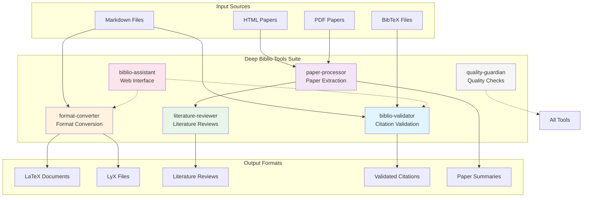
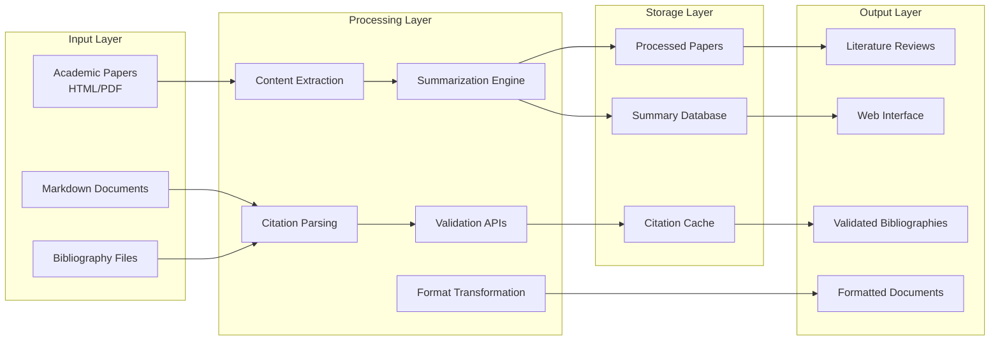

# Deep Biblio Tools - Proposed Architecture

## Tool Ecosystem Overview



## Data Flow Architecture



## CLI Command Structure

```bash
# Main command
biblio-tools <tool> <action> [options]

# Tool-specific commands
biblio-tools validate citations paper.md --format apa
biblio-tools validate bibliography refs.bib --check-dois

biblio-tools process extract paper.html --output paper.md
biblio-tools process summarize paper.md --compression 25

biblio-tools review generate /papers --theme "ML in Construction"
biblio-tools review combine summaries/ --output review.md

biblio-tools convert md-to-latex paper.md --style arxiv
biblio-tools convert latex-to-lyx paper.tex

biblio-tools assist proofread paper.md --port 8080
biblio-tools assist merge bib1.bib bib2.bib --output merged.bib

biblio-tools quality check-all paper.md
biblio-tools quality fix-imports src/
```

## Package Distribution Strategy

Each tool will be available as:

1. **Individual Package**
   ```bash
   pip install biblio-validator
   pip install paper-processor
   pip install literature-reviewer
   ```

2. **Full Suite**
   ```bash
   pip install deep-biblio-tools[all]
   ```

3. **Specific Combinations**
   ```bash
   pip install deep-biblio-tools[research]  # validator + processor + reviewer
   pip install deep-biblio-tools[writing]   # converter + assistant
   ```

## Integration Points

### API Endpoints (for biblio-assistant)
```
/api/validate/citation
/api/validate/bibliography
/api/convert/markdown-to-latex
/api/summarize/paper
/api/review/generate
```

### Shared Components
- Citation models and parsers
- Publisher API clients
- Common utilities (file handling, caching)
- Configuration management

### Plugin System
Future support for:
- Custom citation styles
- Additional paper sources
- Third-party validation services
- Export format plugins
