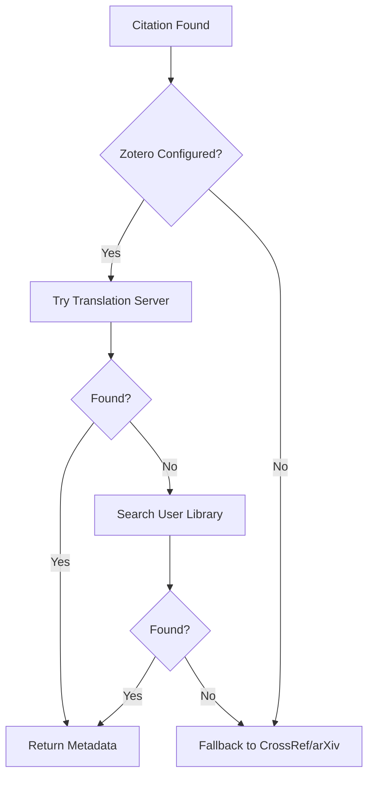

# Zotero Integration Setup Guide

This guide will help you set up Zotero integration with deep-biblio-tools for enhanced bibliographic metadata retrieval.

> **Quick Start**: If you already have Zotero credentials, skip to [Setting Up Environment Variables](#setting-up-environment-variables)

## Table of Contents

- [Overview](#overview)
- [Getting Your Zotero Credentials](#getting-your-zotero-credentials)
- [Setting Up Environment Variables](#setting-up-environment-variables)
- [How the Zotero API Works](#how-the-zotero-api-works)
- [Usage Examples](#usage-examples)
- [Troubleshooting](#troubleshooting)

## Overview

Zotero integration in deep-biblio-tools provides:

- **Automatic metadata extraction** from DOIs, ISBNs, arXiv IDs, and URLs
- **Access to your personal Zotero library** for consistent citation data
- **High-quality metadata** from Zotero's translation server
- **Better BibTeX-compatible** citation keys

## Getting Your Zotero Credentials

### Step 1: Create a Zotero Account

If you don't have a Zotero account, create one at [https://www.zotero.org/user/register](https://www.zotero.org/user/register)

### Step 2: Generate an API Key

1. Go to [https://www.zotero.org/settings/keys/new](https://www.zotero.org/settings/keys/new)
2. Log in to your Zotero account
3. Configure your API key:
   - **Description**: Enter a name like "deep-biblio-tools"
   - **Personal Library**: Check "Allow library access"
   - **Notes**: Check "Allow notes access" (if you want to access notes)
   - **Access Permissions**: Select "Read Only" (recommended) or "Read/Write"

4. Click "Save Key"
5. **Copy and save your API key** - you won't be able to see it again!

### Step 3: Find Your Library ID

Your library ID is your Zotero user ID:

1. Go to [https://www.zotero.org/settings/keys](https://www.zotero.org/settings/keys)
2. Look for "Your userID for use in API calls is **XXXXXXX**"
3. This number is your library ID

Alternatively, you can find it in your Zotero profile URL:
- Go to your profile: `https://www.zotero.org/yourusername`
- The number in the URL is your user ID

## Setting Up Environment Variables

### Method 1: Using a `.env` File (Recommended)

1. Create a `.env` file in your project root:

```bash
# Create .env file
touch .env

# Add to .gitignore to keep credentials safe
echo ".env" >> .gitignore
```

2. Add your credentials to the `.env` file:

```bash
# .env
ZOTERO_API_KEY=your_api_key_here
ZOTERO_LIBRARY_ID=your_library_id_here
```

3. Load the environment variables:

```bash
# Using python-dotenv (install with: pip install python-dotenv)
python -c "from dotenv import load_dotenv; load_dotenv()"

# Or export them manually
export $(cat .env | xargs)
```

### Method 2: Shell Configuration

Add to your shell configuration file (`~/.bashrc`, `~/.zshrc`, etc.):

```bash
# Zotero API credentials for deep-biblio-tools
export ZOTERO_API_KEY="your_api_key_here"
export ZOTERO_LIBRARY_ID="your_library_id_here"
```

Then reload your shell:

```bash
source ~/.bashrc  # or ~/.zshrc
```

### Method 3: Temporary Session

For testing, you can set variables for the current session:

```bash
export ZOTERO_API_KEY="your_api_key_here"
export ZOTERO_LIBRARY_ID="your_library_id_here"
```

### Method 4: Using direnv (Advanced)

If you use [direnv](https://direnv.net/):

1. Create `.envrc` file:

```bash
# .envrc
export ZOTERO_API_KEY="your_api_key_here"
export ZOTERO_LIBRARY_ID="your_library_id_here"
```

2. Allow direnv:

```bash
direnv allow
```

## How the Zotero API Works

### API Basics

The Zotero Web API v3 ([documentation](https://www.zotero.org/support/dev/web_api/v3/basics)) provides:

1. **Translation Server**: Automatic metadata extraction from identifiers
   - Endpoint: `https://translate.zotero.org/search`
   - No authentication required
   - Accepts DOIs, ISBNs, arXiv IDs, URLs

2. **Library API**: Access to your personal Zotero library
   - Base URL: `https://api.zotero.org`
   - Requires API key for private libraries
   - Endpoints:
     - `/users/{userID}/items` - Access user library items
     - `/groups/{groupID}/items` - Access group library items

### How deep-biblio-tools Uses the API



1. **First attempt**: Zotero Translation Server
   - Sends identifier (DOI, arXiv ID, etc.)
   - Gets structured metadata back
   - No API key needed

2. **Second attempt**: User's Zotero Library
   - Searches your personal library
   - Uses your API key and library ID
   - Finds items you've already saved

3. **Fallback**: CrossRef and arXiv APIs
   - If Zotero doesn't find the item
   - Maintains compatibility with non-Zotero users

## Usage Examples

### Basic Usage with Environment Variables

Once your environment variables are set:

```bash
# Citations will automatically use Zotero
deep-biblio-md2latex paper.md
```

### Explicit Credentials

```bash
# Pass credentials directly
deep-biblio-md2latex paper.md \
  --zotero-api-key YOUR_KEY \
  --zotero-library-id YOUR_ID
```

### Python Script Usage

```python
import os
from dotenv import load_dotenv
from deep_biblio_tools.converters.md_to_latex import MarkdownToLatexConverter

# Load environment variables
load_dotenv()

# Create converter with Zotero integration
converter = MarkdownToLatexConverter(
    zotero_api_key=os.getenv("ZOTERO_API_KEY"),
    zotero_library_id=os.getenv("ZOTERO_LIBRARY_ID")
)

# Convert your document
converter.convert("paper.md")
```

### Testing Your Setup

Test if Zotero integration is working:

```bash
# Create a test file
echo '# Test
Citation: [Mildenhall et al. (2020)](https://arxiv.org/abs/2003.08934)' > test.md

# Convert with verbose output
deep-biblio-md2latex test.md -v

# Check the log for "Fetched metadata from Zotero"
```

## Troubleshooting

### Common Issues

1. **"Invalid API key" error**
   - Verify your API key is correct
   - Check that you copied the entire key
   - Ensure no extra spaces or quotes

2. **"Library not found" error**
   - Verify your library ID is correct
   - Use your numeric user ID, not username
   - For groups, use the group ID

3. **No Zotero metadata retrieved**
   - Check if the item exists in your library
   - Verify the identifier format (DOI should include "10.")
   - Try the Zotero translation server directly

### Debugging

Enable verbose output to see what's happening:

```bash
# See detailed API calls
deep-biblio-md2latex paper.md -v

# Check if environment variables are set
python -c "import os; print(f'API Key: {bool(os.getenv(\"ZOTERO_API_KEY\"))}'); print(f'Library ID: {os.getenv(\"ZOTERO_LIBRARY_ID\")}')"
```

### API Rate Limits

Zotero API has rate limits:
- **Default**: 100 requests per hour
- **With API key**: Higher limits
- deep-biblio-tools caches results to minimize API calls

### Security Best Practices

1. **Never commit credentials**:
   ```bash
   # Add to .gitignore
   .env
   .envrc
   *.key
   ```

2. **Use read-only API keys** for citation retrieval

3. **Rotate keys periodically** via [Zotero settings](https://www.zotero.org/settings/keys)

4. **Use environment variables** instead of hardcoding

## Additional Resources

- [Zotero Web API Documentation](https://www.zotero.org/support/dev/web_api/v3/basics)
- [Zotero API Playground](https://github.com/zotero/api-playground)
- [Better BibTeX for Zotero](https://retorque.re/zotero-better-bibtex/)
- [deep-biblio-tools Documentation](https://github.com/petteriTeikari/deep-biblio-tools)

## Getting Help

If you encounter issues:

1. Check the [troubleshooting section](#troubleshooting) above
2. Enable verbose mode (`-v`) to see detailed logs
3. Open an issue on [GitHub](https://github.com/petteriTeikari/deep-biblio-tools/issues)
4. Include your debug output (remove any API keys!)
